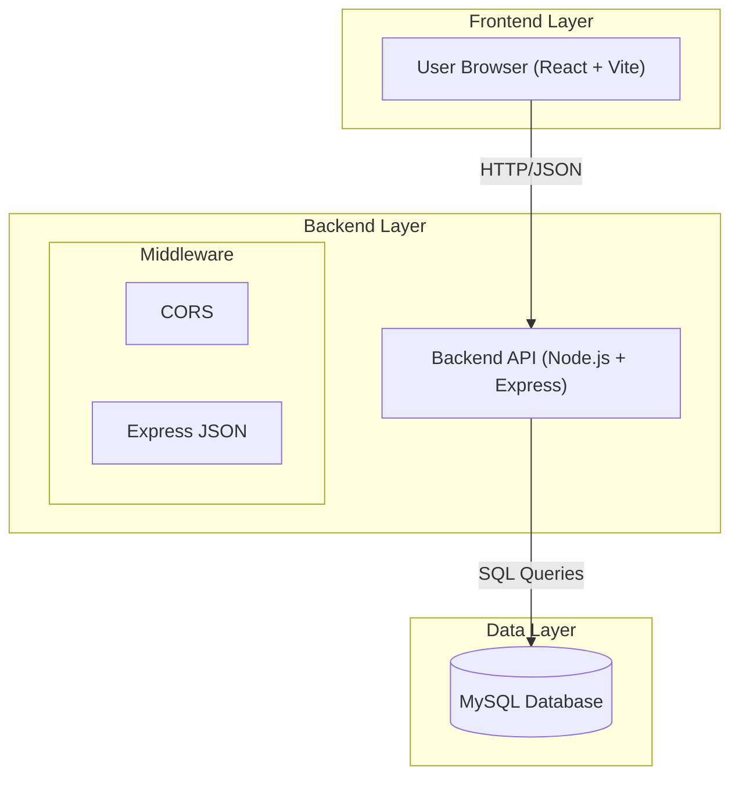
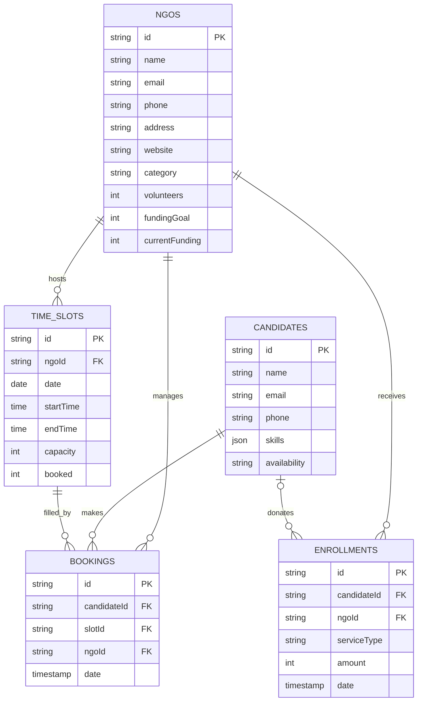
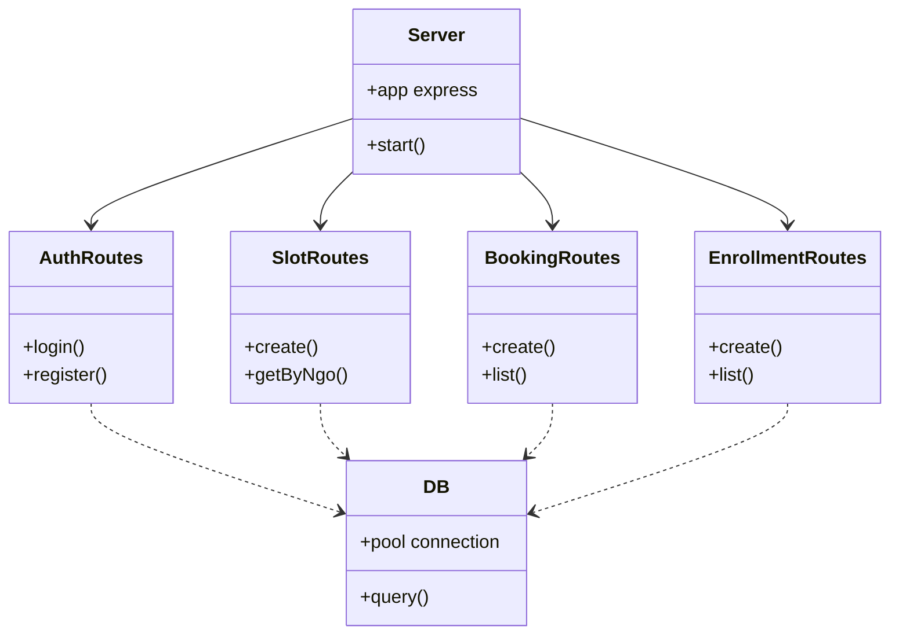
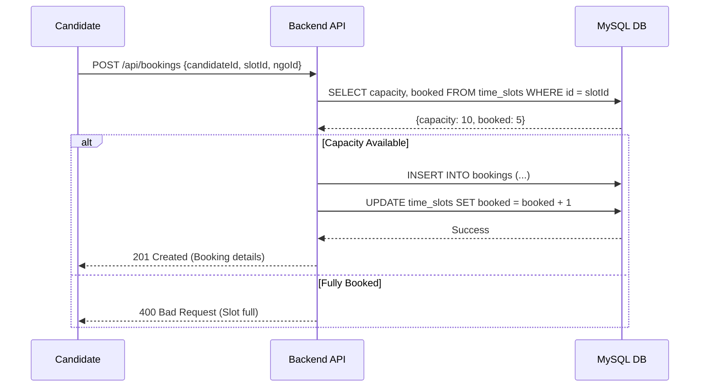
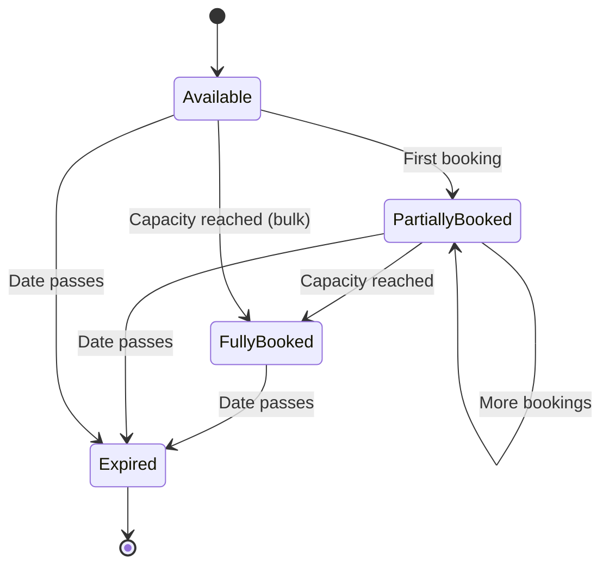

# NGO Management Project - Diagram Definitions

This document contains the Mermaid source code for the requested diagrams.

## 1. System Architecture


## 2. Use Case Diagram
```mermaid
useCaseDiagram
    actor "NGO Admin" as NGO
    actor "Candidate / Volunteer" as Candidate
    
    package "NGO Management System" {
        usecase "Register NGO" as UC1
        usecase "Login" as UC2
        usecase "Create Time Slot" as UC3
        usecase "View Dashboard Stats" as UC4
        usecase "Search NGOs" as UC5
        usecase "Book Volunteer Slot" as UC6
        usecase "Donate / Enroll" as UC7
        usecase "Manage Profile" as UC8
    }
    
    NGO --> UC1
    NGO --> UC2
    NGO --> UC3
    NGO --> UC4
    NGO --> UC8
    
    Candidate --> UC2
    Candidate --> UC5
    Candidate --> UC6
    Candidate --> UC7
    Candidate --> UC8
```

## 3. ER Diagram


## 4. DFD (Level 1)
```mermaid
graph LR
    User((User)) --> P1(Authentication)
    P1 --> DS1[(User Store)]
    
    User --> P2(NGO Management)
    P2 <-> DS2[(NGOs table)]
    
    User --> P3(Booking System)
    P3 <-> DS3[(Slots & Bookings)]
    
    User --> P4(Enrollment)
    P4 --> DS4[(Enrollments table)]
```

## 5. Class Diagram (Backend)


## 6. Sequence Diagram (Booking Flow)


## 7. State Chart Diagram (Time Slot)


## 8. Activity Diagram (User Journey)
```mermaid
activityDiagram
    start
    :User Opens Web Page;
    if (Is Registered?) then (No)
        :Register (NGO or Candidate);
    endif
    :Login;
    if (User Type?) then (Candidate)
        :Search NGOs;
        :View NGO Details;
        :Select Time Slot;
        :Confirm Booking;
    else (NGO Admin)
        :View Dashboard;
        :Create New Time Slot;
        :Manage Enrollments;
    endif
    stop
```
